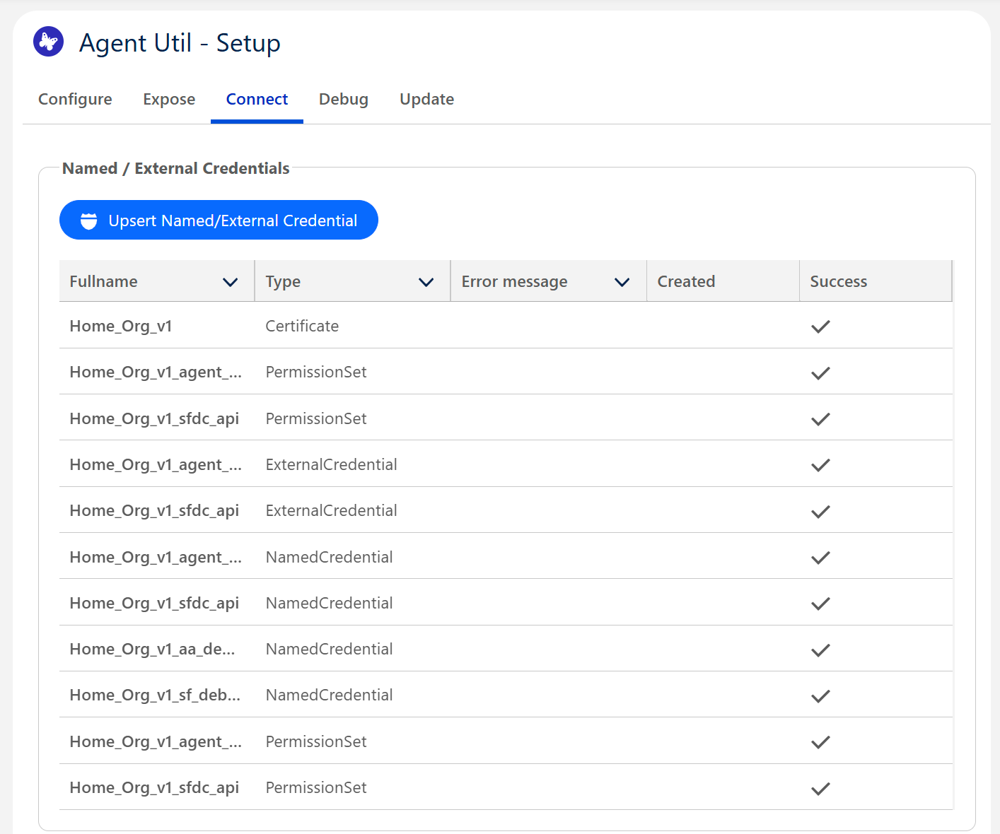

# Salesforce Apex - Lightweight - Agent Util
A lightweight set of tools for calling the Salesforce Agent (Agentforce) API and setting up te required Connected App and Named/External Credential

## !! Consumption / Limit / Security Warning !!
- Please remember that Agent conversations are **charged** according to the Salesforce consumption based model. Test with care and be aware of the **cost implications** that are applicable when calling the Agent API.
- API callouts might take longer than average. Keep in mind the **concurrent long running Apex limits**, this tool is for testing.
My guess is that an Apex API approach on Salesforce is not scalable.
- This tool is to set up test connections easily for development fases. Make sure to discuss all connection related settings with a certified security consultant before releasing anything to production.

## Limitations
Given the Apex govenor limits we have to deal with and the fact this is mainly a testing tool there are a couple of limitations to keep in mind:
- Only the synchronous `sendMessage` API is supported, Apex does not support subscribing to a streaming service
- API responses need to complete within `120 seconds` as this is the maximum response time Apex callouts can have
- Keep track of the concurrent long running Apex Limits
- At TDX25 it was announced that there is no charge in Scratch Orgs and Developer Edition Orgs, just a limit of 120 callouts per hour.

## Blog
The full detailed configuration instructions and use of the UI can be found here
- [A Salesforce Agent Utility](https://medium.com/@justusvandenberg/a-salesforce-agent-force-api-utility-7f359264759f)

## Dependencies
| Info | Value | ||
|---|---|---|---|
|Name|Lightweight - SOAP Util||
|Version|0.3.0||
|**Managed** | `sf package install --wait 30 --security-type AllUsers --package 04tP30000014Ev3IAE` | [Install in production](https://login.salesforce.com/packaging/installPackage.apexp?mgd=true&p0=04tP30000014Ev3IAE) | [Install in Sandbox](https://test.salesforce.com/packaging/installPackage.apexp?mgd=true&p0=04tP30000014Ev3IAE)|
|**Unlocked**| `sf package install --wait 30 --security-type AllUsers --package 04tP30000014EwfIAE` | [Install in production](https://login.salesforce.com/packaging/installPackage.apexp?p0=04tP30000014EwfIAE)          | [Install in Sandbox](https://test.salesforce.com/packaging/installPackage.apexp?p0=04tP30000014EwfIAE)|

## Package Info
| Info | Value | ||
|---|---|---|---|
|Name|Lightweight - Agent Util||
|Version|0.5.0||
|**Managed** | `sf package install --wait 30 --security-type AllUsers --package 04tP30000016z8HIAQ` | [Install in production](https://login.salesforce.com/packaging/installPackage.apexp?mgd=true&p0=04tP30000016z8HIAQ) | [Install in Sandbox](https://test.salesforce.com/packaging/installPackage.apexp?mgd=true&p0=04tP30000016z8HIAQ)|
|**Unlocked**| `sf package install --wait 30 --security-type AllUsers --package 04tP30000016zD7IAI` | [Install in production](https://login.salesforce.com/packaging/installPackage.apexp?p0=04tP30000016zD7IAI)          | [Install in Sandbox](https://test.salesforce.com/packaging/installPackage.apexp?p0=04tP30000016zD7IAI)|

## UI Tools
Besides Apex Classes this utillity contains a set of UI tools to setup the Agent Api connected App and Named Credentials with just a few clicks. Once set up, the utility contains a UI for the API calls that is some sort of mini version of Postman.


Overview of the API interface

Configure the metadata to be created

Expose the Agent API

Connect to an Agent

## Agent Api Methods
To call the Agent Api you will need a couple of basic things
- A Named Credential to an Agent Api endpoint (either the Sfdc Api or a Remote Org)
- A random UUID as your reference of the session (In the start methods)
- The session Id that is returned from a startSession() API Call
- The rest is straight forward :-)

### Start Session
```java
/**
 * @description Method to call the Agent Api's startSession() method
 * @docs        https://developer.salesforce.com/docs/einstein/genai/references/agent-api?meta=startSession
 */
agentforce1.Api.Callout callout = agentforce1.Api.startSession(
    String namedCredentialName, // An Agent API Named Credential endpoint
    String myDomainUrl,         // The my domain URL of the Agent you're connecting to
    String agentId,             // The Id of the "Bot" with prefix "0Xx"
    String externalSessionKey,  // The random UUID assigned by the caller
    Boolean bypassUser,         // Option to bypass the userid (true is the recommended value)
    agentforce1.Api.Variable[] variables // Optional list of variables
);

// EXAMPLE
agentforce1.Api.Callout callout = agentforce1.Api.startSession(
    'Home_Org_v1_agent_api',
    Url.getOrgDomainUrl().toExternalForm(),
    '0XxQ10000001IHRKA2',
    UUID.randomUUID().toString(),
    true,
    new agentforce1.Api.Variable[]{
        new agentforce1.Api.Variable(
            '$Context.EndUserLanguage',
            'Text',
            'en_US'
        )
    }
);

// Fetch the session id from the response using untyped, cache this somewhere
String untypedSessionId = (String)((Map<String,Object>) JSON.deserializeUntyped(callout.response.getBody())).get('sessionId');

// Fetch the session Id using the agentforce1.Api.StartSessionResponse class
agentforce1.Api.StartSessionResponse response = (agentforce1.Api.StartSessionResponse) JSON.deserialize(callout.response.getBody(), agentforce1.Api.StartSessionResponse.class);
String typedSessionId = response.sessionId;

// Both methods should return the same value
Assert.areEqual(untypedSessionId,typedSessionId);
```


### Send Message
```java
/**
 * @description Method to call the Agent Api's sendMessage() method
 * @docs        https://developer.salesforce.com/docs/einstein/genai/references/agent-api?meta=sendMessage
 */
agentforce1.Api.Callout callout = agentforce1.Api.sendMessage(
    String  namedCredentialName, // An Agent API Named Credential endpoint
    String  sessionId,           // session Id returned from the startSession()
    Integer sequenceId,          // Sequence that should be incremented each message
    String  message,             // The chat message to send
    String  messageType,         // Type of message (Only 'Text' is supported atm)
    String  inReplyToMessageId,  // UUID Of the previous methods (Optional)
    agentforce1.Api.Variable[] variables // Optional list of variables
);

// EXAMPLE (variables are optional)
agentforce1.Api.Callout callout = agentforce1.Api.sendMessage(
    'Home_Org_v1_agent_api',
    '7f768846-0166-44aa-a1d5-c075dd2ba7c2',
    0,
    (
        'Show me Child friendly Hotels in Edinburgh with a Swimming Pool ' +
        'that have been positively rated in the user reviews by families ' +
        'with young children. Only include reviews from the last 6 months'
    ),
    'Text',
    'b69e4ca3-639a-49ad-8513-c075d8a41db6', // Optional 
    new agentforce1.Api.Variable[]{
        new agentforce1.Api.Variable(
            '$Context.EndUserLanguage',
            'Text',
            'en_US'
        )
    }
);

// Output the response body
System.debug(callout.response.getBody());
```


### End Session
```java
/**
 * @description Method to call the Agent Api's endSession() method
 * @docs        https://developer.salesforce.com/docs/einstein/genai/references/agent-api?meta=endSession
 */
agentforce1.Api.Callout callout = agentforce1.Api.endSession(
    String namedCredentialName, // An Agent API Named Credential endpoint
    String sessionId,           // session Id returned from the startSession()
    String reason               // The reason, usually 'UserRequest'
);


// EXAMPLE
agentforce1.Api.Callout callout = agentforce1.Api.endSession(
    'Home_Org_v1_agent_api',
    '3fc469c4-5c3a-479b-b232-b25169dc02eb',
    'UserRequest'
);

// Output the response body
System.debug(callout.response.getBody());
```

### Submit Feedback
```java
/**
 *  Method to call the Agent Api's endSession() method
 * @docs https://developer.salesforce.com/docs/einstein/genai/references/agent-api?meta=submitFeedback
 */
agentforce1.Api.Callout callout = agentforce1.Api.submitFeedback(
    String namedCredentialName, // An Agent API Named Credential endpoint
    String sessionId,           // session Id returned from the startSession()
    String feedback,            // GOOD or BAD
    String feedbackId,          // UUID to identify the feedback
    String feedbackText,        // Additional feedback
    String userId               // Should be the user Id of the Integration User for remote orgs
);

// EXAMPLE
agentforce1.Api.Callout callout = agentforce1.Api.submitFeedback(
    'Home_Org_v1_agent_api',
    '7f768846-0166-44aa-a1d5-c075dd2ba7c2',
    'GOOD',
    'affea93a-1ad6-4834-802d-55f8c137e187',
    'Good answer, but could be more detailed',
    UserInfo.getUserId()
);

// Output the response status code as there is no body, this should be 201 for success
Assert.areEqual(
    201,
    callout.response.getStatusCode(),
    'The status code was not 201. Something went wrong submitting the feedback'
);
```


## Data Structures
```java
/**
 * agentforce1.Api.Callout
 */
class Callout{

    HttpRequest  request;
    HttpResponse response;
    
    // Basic constructor
    Callout(HttpRequest request, HttpResponse response){}
}


/**
 * agentforce1.Api.Variable
 */
class Variable{

    String name;
    String type;
    String value;

    // Basic constructor
    Variable(String name, String type, String value){}
}


/**
 * agentforce1.Api.StartSessionResponse
 */
class StartSessionResponse{
    String sessionId;
    agentforce1.Api.Message[] messages;   
}


/**
 * agentforce1.Api.SendMessageResponse
 */
class SendMessageResponse{
    agentforce1.Api.Message[] messages;   
}


/**
 * agentforce1.Api.Message
 */
class Message{
    String id;
    String type;
    String feedbackId;
    String planId;
    Boolean isContentSafe;
    String message;
    String reason;
    agentforce1.Api.Result[]   result;
    agentforce1.Api.Citation[] citedReferences;
}


/**
 * agentforce1.Api.Result
 */
class Result{
    String type;
    String property;
    Object value;
}


/**
 * agentforce1.Api.Citation
 */
class Citation{
    String type;
    String value;
}


/**
 * agentforce1.Api.CalloutError
 */
class CalloutError{

    Integer status;
    String  path;
    String  mode;
    String  requestId;
    String  error;
    String  message;
    Integer timestamp;
    Boolean expected;

    // Returns a list of errors (Note this is for JSON strings and a bit buggy)
    agentforce1.Api.Error[] getErrors();
}


/**
 * agentforce1.Api.Error
 */
class Error{
    
    String errorCode;
    String message;

    // Basic constructor
    Error(String errorCode, String message)
}
```

## Resources
[Create Agent Enabled Scratch Orgs ](https://developer.salesforce.com/docs/einstein/genai/guide/scratch-org.html)

## Common Errors
- 404, everything seems to work but you get a 404 when starting a session. This is due to the Connected App not returning a JWT but a Session Id